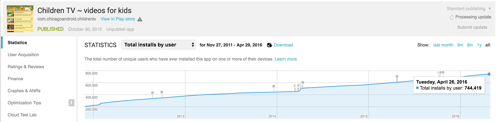
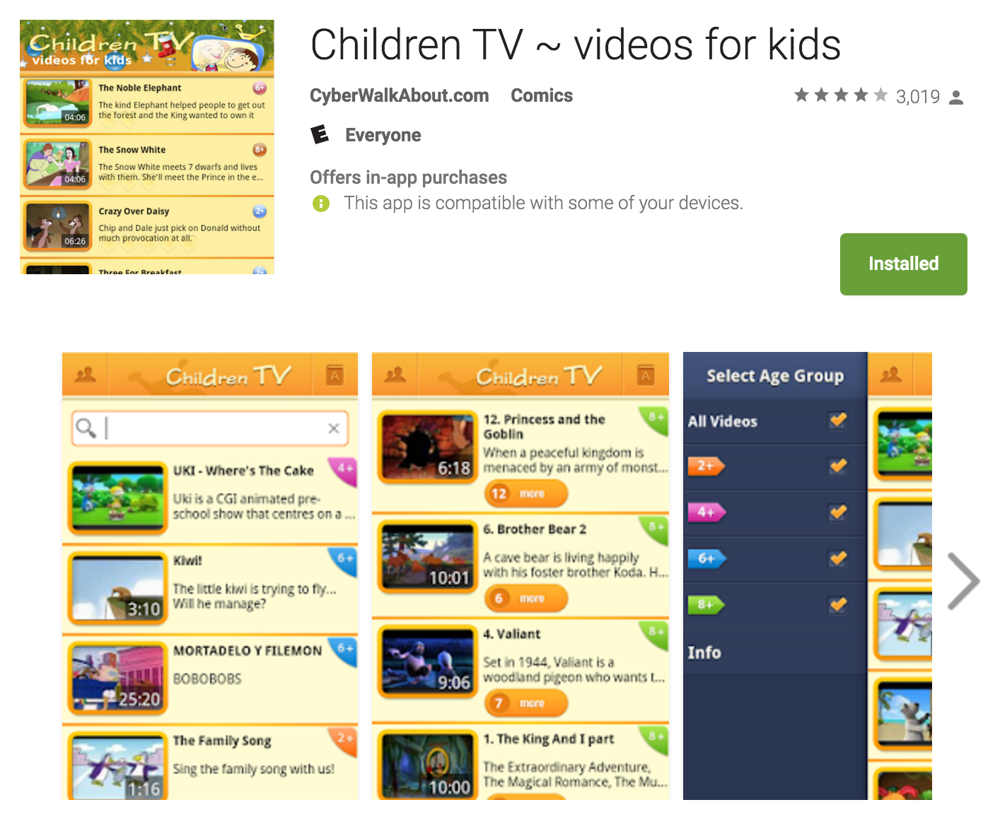

# # ChildrenTV

ChildrenTV is a very sucessful Android app with over 745,000 installs. The original idea for the app was that we did not want my daughter to be browsing YouTube unsupervised and only watch age-appropriate content. At the same time we wanted to selecte cartoons with particular language for child to get additional exposure. 

The app however needs **constant maintenannce to keep the YouTube videos for children up to date and organized**. SInce the app does not provide any revenues, and I do not employ any staff anymore, the community support is needed to keep this app going.

[Download ChildrenTV on Google Play](https://play.google.com/store/apps/details?id=com.chicagoandroid.childrentv)

